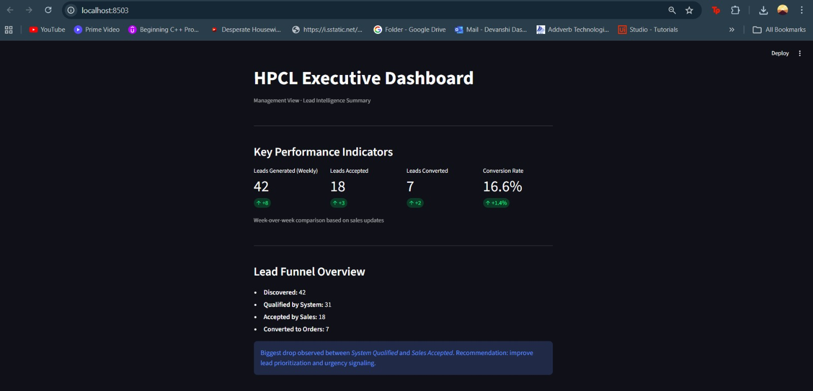
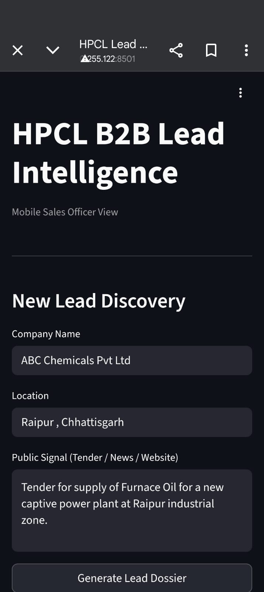
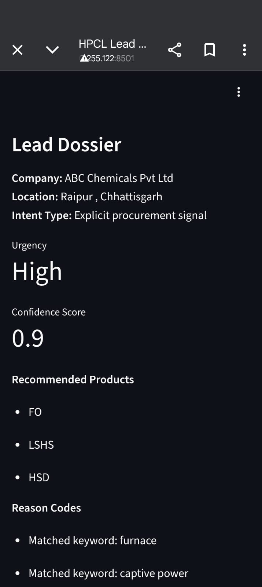
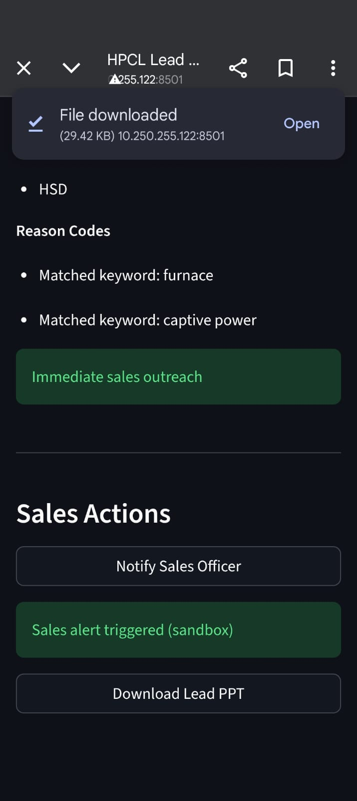
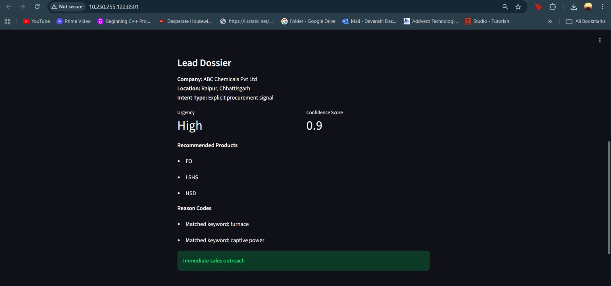
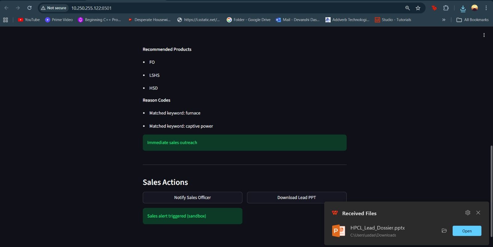
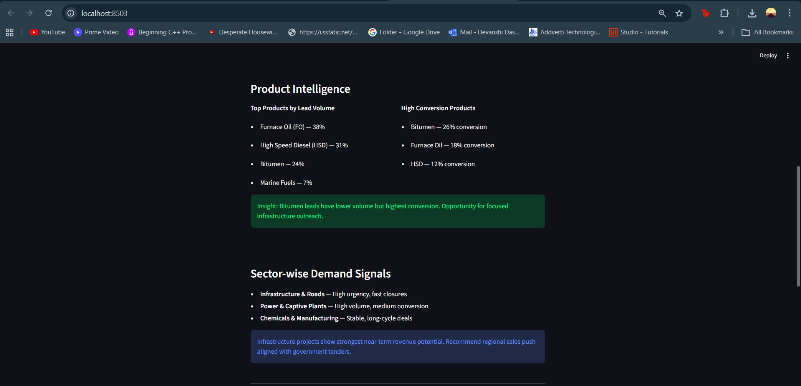
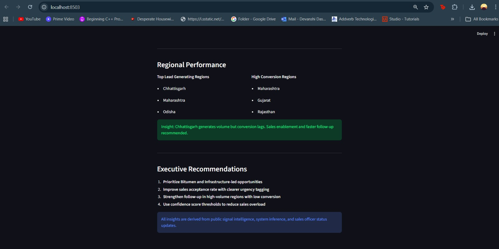

# 🚀 HPCL AI Lead Intelligence Agent

> AI-Powered Lead Discovery, Product Recommendation, and Sales Intelligence Platform for HPCL Direct Sales

<p align="center">
  
</p>

<p align="center">
  <b>Transforming Public Business Signals into Actionable Sales Opportunities</b>
</p>

---

## 📌 Overview

The HPCL AI Lead Intelligence Agent is an intelligent lead discovery and sales intelligence platform built to help HPCL's Direct Sales (DS) business proactively identify industrial customers before competitors.

The platform continuously analyzes publicly available signals such as tenders, project announcements, company websites, industry news, and expansion reports to identify potential business opportunities.

Instead of relying solely on manual prospecting and relationships, the platform enables a scalable, proactive, and data-driven sales approach.

### Key Capabilities

- 🔍 Automated Lead Discovery
- 🛢️ Product Requirement Inference
- 📊 Lead Prioritization & Scoring
- 📄 Lead Dossier Generation
- 📱 Mobile Sales Workflow
- 📈 Executive Dashboard
- 🔔 Sales Notifications
- ✅ Explainable Recommendations

---

## 🎯 Business Problem

HPCL's Direct Sales division serves large industrial customers across sectors such as:

- Power Generation
- Manufacturing
- Chemicals
- Mining
- Infrastructure
- Ports & Shipping

Finding new business opportunities often involves:

- Manual prospecting
- Monitoring numerous information sources
- Delayed opportunity identification
- Difficulty prioritizing leads
- Limited visibility into emerging industrial demand

As a result, valuable opportunities may be identified too late.

---

## 💡 Solution

The HPCL AI Lead Intelligence Agent converts public business signals into sales-ready opportunities.

### Workflow

```text
Public Signals
(Tenders, News, Websites)
            │
            ▼
Signal Extraction Engine
            │
            ▼
Product Need Inference Engine
            │
            ▼
Lead Scoring Engine
            │
            ▼
Lead Dossier Generator
            │
            ▼
Mobile Sales Application
            │
            ▼
Executive Dashboard
```

---

## ⚙️ Core Components

### 1️⃣ Backend API (`main.py`)

Built using FastAPI.

#### Responsibilities

- Accept public signal inputs
- Trigger analysis workflow
- Generate lead dossiers
- Return structured recommendations

#### Endpoint

```http
POST /analyze
```

---

### 2️⃣ Product Intelligence Engine (`rules.py`)

Converts industrial signals into likely HPCL product requirements.

#### Example

Input Signal:

```text
Tender issued for a captive power plant with industrial boilers.
```

Recommended Products:

```text
• Furnace Oil (FO)
• LSHS
• HSD
```

#### How It Works

The engine analyzes:

- Equipment mentions
- Industrial processes
- Sector indicators
- Operational requirements

and maps them to HPCL Direct Sales products using explainable business rules.

---

### 3️⃣ Lead Scoring Engine (`scorer.py`)

One of the most important components of the solution.

#### What It Does

Not every lead has the same business value.

The scoring engine evaluates how promising a lead is and helps sales teams focus on the most valuable opportunities first.

#### Simple Explanation

Think of it as a smart sales assistant that answers:

> "Should the sales team contact this company immediately or later?"

#### Scoring Factors

| Factor | Description |
|----------|------------|
| Intent Strength | How strongly the signal indicates a buying requirement |
| Signal Clarity | How clearly a product requirement can be inferred |
| Business Relevance | Alignment with HPCL's Direct Sales portfolio |

#### Example Output

```json
{
  "urgency": "High",
  "confidence": 88
}
```

#### Benefits

- Faster prioritization
- Better sales productivity
- Reduced manual effort
- Improved conversion potential

---

### 4️⃣ Lead Dossier Generator

Creates structured sales-ready reports containing:

- Company Information
- Industry Sector
- Product Recommendations
- Reason Codes
- Urgency Classification
- Confidence Score
- Recommended Next Action

---

### 5️⃣ Mobile Sales Application (`ui.py`)

A mobile-friendly interface designed for HPCL field sales officers.

#### Features

- New Lead Discovery
- Lead Dossier Review
- Product Recommendations
- Sales Notifications
- One-Tap Follow-Up Actions

---

### 6️⃣ Executive Dashboard (`dashboard.py`)

Provides management-level visibility into lead generation activities.

#### Dashboard Insights

- Leads Generated
- Conversion Funnel
- Product Trends
- Sector Analysis
- Regional Distribution
- Weekly Performance

---

# 📸 Application Screenshots

## 📱 Mobile Sales Application

<p align="center">
  
  
  
</p>

<p align="center">
  <i>Lead Discovery • Lead Review • Sales Action Workflow</i>
</p>

---

## 📄 Lead Dossier

<p align="center">
  
  
</p>

<p align="center">
  <i>Structured Sales-Ready Lead Dossier</i>
</p>

---

## 🛢️ Product Intelligence & Regional Insights

<p align="center">
  
  
</p>

<p align="center">
  <i>Explainable Product Recommendations & Regional Demand Analysis</i>
</p>

---

## 📊 Executive Dashboard

<p align="center">
  
</p>

<p align="center">
  <i>Executive KPIs, Lead Funnel, Product Trends, and Sector Insights</i>
</p>

---

## 📂 Project Structure

```text
hpcl-ai-lead-intelligence/
│
├── main.py
├── rules.py
├── scorer.py
├── ui.py
├── dashboard.py
│
├── demo_dataset.csv
├── MODEL_CARD.md
├── ARCHITECTURE.md
├── requirements.txt
│
├── screenshots/
│   ├── DOSSIER_PPT.jpeg
│   ├── DOSSIER_RESULT.jpeg
│   ├── HPCL_EXECUTIVE_DASHBOARD.jpeg
│   ├── MOBILE_APP.jpeg
│   ├── MOBILE_APP_2.jpeg
│   ├── MOBILE_APP_3.jpeg
│   ├── PRODUCT_INTELLIGENCE.jpeg
│   └── REGIONAL_PERFORMANCE.jpeg
│
└── README.md
```

---

## 📊 Example Workflow

### Input Signal

```text
Tender issued for installation of a captive power plant with industrial boilers.
```

### Product Recommendation

```text
- Furnace Oil
- LSHS
- HSD
```

### Lead Score

```text
Urgency: High
Confidence: 90%
```

### Generated Output

```text
Sales-Ready Lead Dossier
```

---

## 🚀 Running the Project

### Install Dependencies

```bash
pip install -r requirements.txt
```

### Start Backend API

```bash
uvicorn main:app --reload
```

### Launch Mobile Application

```bash
streamlit run ui.py
```

### Launch Executive Dashboard

```bash
streamlit run dashboard.py
```

---

## 📈 Business Impact

This solution helps HPCL:

- Discover opportunities earlier
- Improve sales productivity
- Prioritize high-value leads
- Reduce manual market scanning
- Scale intelligence operations
- Enable data-driven decision making

---

## 🔮 Future Enhancements

- Machine Learning-Based Lead Scoring
- Live Web Crawling
- RSS Feed Integration
- CRM Integration
- ERP Integration
- Territory-Based Lead Assignment
- Feedback-Driven Model Retraining

---

## 🛡️ Design Principles

- Explainability First
- Human-in-the-Loop Decision Making
- Enterprise Scalability
- Modular Architecture
- Sales-Centric Workflows
- Policy-Safe Public Data Usage

---

## 📄 Documentation

| File | Purpose |
|--------|---------|
| ARCHITECTURE.md | System Architecture & Deployment |
| MODEL_CARD.md | Model Logic & Limitations |
| demo_dataset.csv | Demo Dataset |
| README.md | Project Documentation |

---

## 👥 Team

Developed as part of the **HPCL B2B Lead Intelligence Challenge** to demonstrate how AI can transform industrial sales intelligence through proactive lead discovery, explainable recommendations, and intelligent opportunity prioritization.
